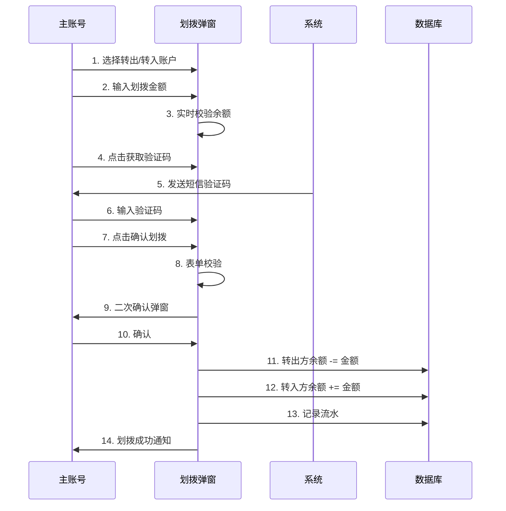
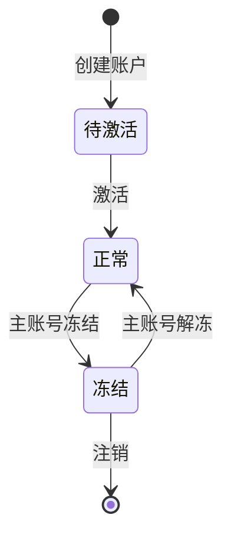

# 项目管理功能 - 产品设计文档

## 文档信息

| 项目名称 | 民匠有约管理系统 - 项目管理功能 |
|---------|------------------------------|
| 文档版本 | V1.0 |
| 创建日期 | 2026-08-03 |
| 更新日期 | 2026-08-03 |
| 负责人 | 产品部 |
| 状态 | 已上线原型 |

## 修订记录

| 版本 | 日期 | 修订内容 |
|-----|------|---------|
| V1.0 | 2026-08-03 | 初始版本，包含项目管理功能完整设计（权限控制、账户总览、账户列表、互相划拨、流水查询） |

---

## 一、功能背景

### 1.1 业务痛点

随着企业业务规模扩大，企业内部通常会有多个独立运作的项目部（如电商运营、品牌营销、活动执行、直播运营等），每个项目部有独立的资金账户和负责人。原有系统存在以下问题：

1. **资金分散管理难** — 企业主账号与各项目部资金分散，无法集中查看总余额
2. **资金调拨效率低** — 项目部之间或主账号与项目部之间的资金调拨需线下操作，缺乏线上化流程
3. **权限控制不清晰** — 子账号也能查看所有项目资金，存在数据安全隐患
4. **流水追溯困难** — 资金划拨无记录，难以追溯历史调拨明细

### 1.2 升级目标

- 建立主账号 + 子项目的多层级账户体系
- 实现资金集中管控，主账号可随时查看和调配所有资金
- 提供安全便捷的线上互相划拨功能
- 严格的权限控制，仅主账号可访问项目管理功能
- 完整的资金流水记录，便于追溯和对账

---

## 二、功能架构

### 2.1 整体架构

```
企业后台
└── 账号管理
    ├── 基本信息
    ├── 账户设置
    ├── 用户列表
    └── 项目管理（仅主账号可见）★ 本次新增
        ├── 账户总览（4 张卡片）
        ├── 项目账户列表
        ├── 互相划拨弹窗
        └── 账户流水抽屉
```

### 2.2 角色权限

| 角色 | 权限范围 | 说明 |
|------|---------|------|
| 主账号 | 项目管理全部功能 | 可查看所有账户、划拨资金、冻结/解冻子项目 |
| 子账号 | 无项目管理访问权限 | 访问时自动跳转至首页并提示无权限 |

### 2.3 账户类型

| 类型 | 标识 | 数量 | 说明 |
|------|------|------|------|
| 主账号 | `master` | 1 个 | 企业主账户，可向下划拨资金 |
| 子项目 | `sub` | N 个 | 各项目部独立账户，可向上或横向划拨 |

---

## 三、页面设计

### 3.1 入口位置

- **菜单路径**：账号管理 → 项目管理
- **路由**：`/company/project-manage`
- **访问权限**：仅主账号可见菜单和页面

### 3.2 账户总览（顶部）

页面顶部展示 4 张总览卡片，左右布局：

| 卡片 | 内容 | 样式 |
|------|------|------|
| 账户总余额 | 主+子项目合计金额，账户数量统计 | 蓝色渐变背景，白色文字 |
| 主账号余额 | 主账号当前余额，账号和负责人 | 白底，红色左边框 |
| 子项目总余额 | 所有子项目余额合计，子项目数量 | 白底，绿色左边框 |
| 快速划拨 | 大号划拨按钮，功能说明 | 黄色虚线边框，浅黄渐变 |

### 3.3 项目账户列表

#### 3.3.1 搜索筛选

| 字段 | 类型 | 说明 |
|------|------|------|
| 关键词 | 文本输入 | 支持按项目名称、账号、负责人模糊搜索 |
| 账户类型 | 下拉选择 | 主账号 / 子项目 |

#### 3.3.2 表格字段

| 列名 | 说明 | 特殊样式 |
|------|------|---------|
| 选择框 | 多选（子项目且状态正常可选） | — |
| 账户类型 | 主账号（红） / 子项目（蓝） | 彩色 Tag + 图标 |
| 项目/账户名称 | 圆形头像 + 项目名 + 账号 | 头像首字 + 渐变色 |
| 负责人 | 姓名 | — |
| 联系电话 | 手机号（脱敏） | — |
| 当前余额 | 金额（大字体绿色） | ¥ xxx.xx |
| 账户状态 | 正常 / 冻结 / 待激活 | 彩色 Tag |
| 创建时间 | yyyy-MM-dd HH:mm:ss | — |
| 关联任务 | 任务数量，可点击查看 | 蓝色链接 |
| 操作 | 划拨 / 流水 / 冻结（解冻） | 文字按钮 |

#### 3.3.3 操作按钮

| 操作 | 适用对象 | 说明 |
|------|---------|------|
| 划拨 | 所有账户 | 打开划拨弹窗，默认该账户为转出方 |
| 流水 | 所有账户 | 打开流水抽屉，查看收支历史 |
| 冻结/解冻 | 仅子项目 | 切换账户状态，二次确认 |

---

## 四、互相划拨功能

### 4.1 划拨规则

| 规则项 | 说明 |
|-------|------|
| 划拨方向 | 任意互转：主→子、子→主、子→子 |
| 转出限制 | 账户状态为"正常"且余额 > 0 |
| 转入限制 | 账户状态为"正常"，且不能与转出方相同 |
| 金额范围 | 0.01 ~ 转出方余额（精度 2 位） |
| 验证方式 | 短信验证码（5 分钟有效） |

### 4.2 划拨弹窗字段

| 字段 | 类型 | 校验规则 |
|------|------|---------|
| 转出账户 | 下拉选择 | 必填，余额 ≤ 0 时禁用 |
| 转入账户 | 下拉选择 | 必填，不能与转出方相同 |
| 划拨金额 | 数字输入 | 必填，>0，≤ 转出方余额 |
| 备注 | 文本域（100字） | 选填 |
| 短信验证码 | 文本+按钮 | 必填，60s 倒计时 |

### 4.3 快速金额

提供 4 个快捷金额按钮，点击自动填入（不超过转出方余额）：
- ¥100
- ¥500
- ¥1,000
- ¥5,000

### 4.4 划拨预览

填写完成后实时展示划拨预览：

```
┌─────────────────┐    →    ┌─────────────────┐
│ 转出账户         │         │ 转入账户         │
│ xxx项目部        │         │ xxx项目部        │
│ （余额 -¥x.xx）  │         │ （余额 +¥x.xx）  │
└─────────────────┘         └─────────────────┘
```

### 4.5 划拨流程



---

## 五、账户流水

### 5.1 流水展示

点击操作列「流水」按钮，右侧滑出抽屉（宽度 620px），展示该账户的收支历史。

### 5.2 流水字段

| 字段 | 说明 | 样式 |
|------|------|------|
| 时间 | yyyy-MM-dd HH:mm:ss | — |
| 类型 | 转入 / 转出 / 结算 | 绿色 / 橙色 / 灰色 Tag |
| 金额 | 正数绿色（+），负数红色（-） | 加粗 |
| 对方账户 | 转出/转入对方的项目名 | — |
| 备注 | 划拨备注或结算说明 | — |
| 操作人 | 发起操作的账号姓名 | — |

### 5.3 流水头部

抽屉顶部展示当前账户信息：
- 账户名称
- 当前余额（大字体绿色）

---

## 六、权限控制

### 6.1 三层权限校验

| 层级 | 位置 | 说明 |
|------|------|------|
| 菜单层 | CompanyLayout.vue | 子账号菜单不显示「项目管理」项 |
| 页面层 | ProjectManage.vue | 子账号访问显示「无访问权限」提示页 |
| 路由层 | router/index.js | `meta.needMaster` 守卫，子账号强行跳转首页 |

### 6.2 角色存储

- 存储位置：`localStorage.company_role`
- 取值：`master`（主账号） / `sub`（子账号）
- 默认值：`master`（未设置时默认主账号）

### 6.3 原型演示

页面顶部提供角色切换器（主账号/子账号），便于产品演示和测试权限效果。**正式上线时需移除**。

---

## 七、账户状态

### 7.1 状态定义

| 状态 | 标识 | 说明 |
|------|------|------|
| 正常 | `success` | 可正常划拨、结算 |
| 待激活 | `info` | 已创建但未激活，不可划拨 |
| 冻结 | `danger` | 已冻结，不可划拨，需解冻后使用 |

### 7.2 状态流转



---

## 八、技术实现

### 8.1 技术栈

- Vue 3 + Composition API
- Element Plus 组件库
- Vue Router 4（路由守卫）
- Pinia / localStorage（状态管理）

### 8.2 关键代码

#### 8.2.1 权限控制

```javascript
// router/index.js
} else if (to.path.startsWith('/company')) {
  if (companyToken) {
    if (to.meta?.needMaster) {
      const role = localStorage.getItem('company_role') || 'master'
      if (role !== 'master') {
        ElMessage.warning('该功能仅主账号可访问')
        next('/company/home')
        return
      }
    }
    next()
  } else {
    next('/company/login')
  }
}
```

#### 8.2.2 菜单过滤

```javascript
// CompanyLayout.vue
const visibleChildren = (children) => {
  if (!children) return []
  return children.filter(c => !c.needMaster || isMasterAccount.value)
}
```

#### 8.2.3 划拨校验

```javascript
const transferRules = {
  fromId: [{ required: true, message: '请选择转出账户', trigger: 'change' }],
  toId: [
    { required: true, message: '请选择转入账户', trigger: 'change' },
    {
      validator: (_, v, cb) => {
        if (v && v === transferForm.fromId) cb(new Error('转出与转入账户不能相同'))
        else cb()
      },
      trigger: 'change'
    }
  ],
  amount: [
    { required: true, message: '请输入划拨金额', trigger: 'blur' },
    {
      validator: (_, v, cb) => {
        if (!v || v <= 0) cb(new Error('金额必须大于 0'))
        else if (v > fromMaxAmount.value) cb(new Error('转出余额不足'))
        else cb()
      },
      trigger: 'blur'
    }
  ]
}
```

#### 8.2.4 划拨执行

```javascript
const onConfirmTransfer = () => {
  transferFormRef.value?.validate((ok) => {
    if (!ok) return
    if (!transferForm.code) { ElMessage.warning('请输入短信验证码'); return }
    const from = accountList.value.find(a => a.id === transferForm.fromId)
    const to = accountList.value.find(a => a.id === transferForm.toId)
    const amt = Number(transferForm.amount)
    ElMessageBox.confirm(
      `确定从「${from.projectName}」划拨 ¥${amt.toFixed(2)} 到「${to.projectName}」吗？`,
      '划拨确认',
      { type: 'warning', confirmButtonText: '确认划拨' }
    ).then(() => {
      from.balance = Number(from.balance) - amt
      to.balance = Number(to.balance) + amt
      transferVisible.value = false
      ElNotification({
        type: 'success',
        title: '划拨成功',
        message: `已从「${from.projectName}」成功划拨 ¥${amt.toFixed(2)} 到「${to.projectName}」`
      })
    })
  })
}
```

---

## 九、涉及文件清单

| 文件 | 说明 | 状态 |
|------|------|------|
| [ProjectManage.vue](file:///workspace/src/views/Company/ProjectManage.vue) | 项目管理主页面 | 新增 |
| [CompanyLayout.vue](file:///workspace/src/layout/CompanyLayout.vue) | 菜单配置 + 权限过滤 | 修改 |
| [router/index.js](file:///workspace/src/router/index.js) | 路由 + 权限守卫 | 修改 |

---

## 十、后续规划

### 10.1 V1.1 规划

- [ ] 接入真实后端接口，替换 mock 数据
- [ ] 角色信息从登录接口返回，移除 localStorage 存储
- [ ] 划拨增加审批流（大额划拨需二次审批）
- [ ] 流水支持时间范围筛选和导出
- [ ] 账户增加充值入口（对接支付通道）

### 10.2 V2.0 规划

- [ ] 项目部独立看板（子账号可见自己项目部数据）
- [ ] 资金预算管理（按月设置预算，超支预警）
- [ ] 自动划拨规则（如余额低于阈值自动从主账号补充）
- [ ] 多币种支持
- [ ] 资金报表与数据分析

---

*文档版本：V1.0*
*更新日期：2026-08-03*
